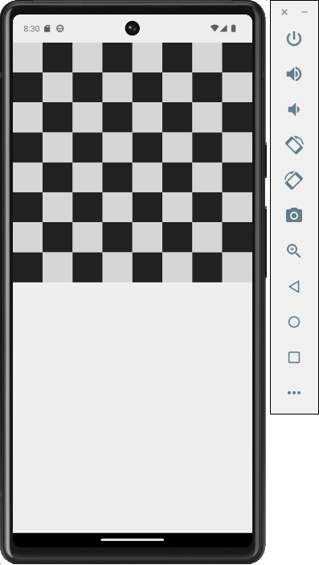

## Pixel Board
# Offline 2-Player Chess Game
# Currently development in progress

Pixel Board is an offline 2-player chess game built using the Flutter framework. It offers a classic 2D chess experience for players to enjoy on their mobile devices. The game is designed to be user-friendly, visually appealing with pixel art graphics, and provides an intuitive interface for chess enthusiasts to engage in strategic battles over the board.

Features
2-Player Gameplay: Play chess with a friend on the same device, taking turns to make moves.

Offline Play: No internet connection is required. Enjoy Pixel Board anytime, anywhere.

Classic Chess Rules: The game follows the standard rules of chess, including castling, en passant, and pawn promotion.

Pixel Art Graphics: Experience a charming visual style with pixel art graphics, adding a unique touch to the game.

Intuitive Interface: User-friendly interface designed for easy understanding and smooth gameplay.

Demo Screenshots

Getting Started
Follow these instructions to set up and run the Pixel Board game on your local machine:

Clone the Repository: Start by cloning this repository to your local machine using the following command:

# Copy code

git clone https://github.com/muj-i/pixel_board.git
Navigate to the Project Directory: Use the terminal to navigate into the cloned project directory:

# Copy code

cd pixel-board

Install Dependencies: Ensure you have Flutter installed. Then, run the following command to install the project dependencies:

# Copy code

flutter pub get

Run the Game: Connect your mobile device or launch an emulator, and execute the following command to run the game:

# Copy code

flutter run

Play the Game: Once the game is launched, you can start a new 2-player chess match with a friend and enjoy the classic chess experience.

# Contributing
Contributions to Pixel Board are welcome! If you find any issues or have ideas for improvements, feel free to open an issue or create a pull request in this repository.

# License
This project is licensed under the MIT License, which means you are free to use, modify, and distribute the code as you like. However, please give credit to the original authors by providing a link to this repository.
